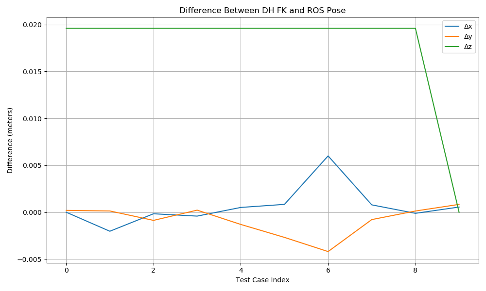

# SCARA Kinematics Analysis

**Student:** Ivon Luiz Correia Martinez Garcia  
**Professor:** Tiago Trindade  
**Course:** ENGA73 – Robotic Systems  
**Institution:** Federal University of Bahia (UFBA)

Origin Repository: [scara_robot_kinematics](https://github.com/IvonLuiz/scara_robot_kinematics/tree/master)

## Objective

The goal of this project is to model the **forward kinematics** of a SCARA manipulator using the **Denavit–Hartenberg (DH) convention**. This model will be validated by comparing the computed end-effector poses against those generated by a ROS-based SCARA simulation.

- Use a custom DH convention to describe the SCARA robot.
- Compute the pose of the end-effector for 10 different sets of joint values.
- Validate the results using the [`scara_robot`](https://github.com/aniketmpatil/scara_robot) ROS package.

---

## Forward Kinematics
### DH Parameters Table

The SCARA manipulator is modeled using the following Denavit–Hartenberg table:

| Joint (i) | θᵢ (variable) | dᵢ (c.u.) | aᵢ (c.u.) | αᵢ (rad) |
|-----------|----------------|------------|------------|-----------|
| 1         | θ₁             | 1.5        | 1.0        | 0         |
| 2         | θ₂             | 0          | 1.0        | π         |
| 3         | 0              | d₃         | 0.0        | 0         |

- **θᵢ**: Joint angle (revolute)
- **dᵢ**: Link offset (along Z)
- **aᵢ**: Link length (along X)
- **αᵢ**: Link twist (between Z axes)

> Note: Joint 3 is prismatic, contributing only to vertical translation.
---

### Denavit–Hartenberg Matrix

Each joint's homogeneous transformation matrix \( A_i \) from frame \( i-1 \) to frame \( i \) is given by the standard Denavit–Hartenberg formula:

\[
A_i =
\begin{bmatrix}
\cos \theta_i & -\sin \theta_i \cos \alpha_i & \sin \theta_i \sin \alpha_i & a_i \cos \theta_i \\
\sin \theta_i & \cos \theta_i \cos \alpha_i & -\cos \theta_i \sin \alpha_i & a_i \sin \theta_i \\
0 & \sin \alpha_i & \cos \alpha_i & d_i \\
0 & 0 & 0 & 1
\end{bmatrix}
\]

The overall forward kinematics transformation \( T \) from the base frame to the end-effector is obtained by the matrix product:

\[
T = A_1 \times A_2 \times A_3
\]

This matrix \( T \) encodes the position and orientation of the end-effector relative to the base frame.

## Development Setup

### Using Docker (Recommended)

To build the Docker image:

```bash
cd Docker
docker build . -t scara_kinematics
```

To run the container with GUI and ROS networking support:

```bash
xhost +local:root
docker run -it --rm \
    --net=host \
    --env="DISPLAY" \
    --env="QT_X11_NO_MITSHM=1" \
    --volume="/tmp/.X11-unix:/tmp/.X11-unix:rw" \
    --volume="$PWD/../ros_ws:/home/catkin_ws" \
    --name scara_container \
    scara_kinematics
```
### Adjusting for Consistency

The reference robot's base height differs from the 0.5 c.u. specified above. To align the Z-coordinate of both systems:

1. **Modify URDF Base Height**  
    Edit `ros_ws/src/scara_robot/urdf/robot_desc.xacro`:
    ```xml
    <xacro:property name="height0" value="0.3" />
    ```
    Change to:
    ```xml
    <xacro:property name="height0" value="0.5" />
    ```

2. **Update Forward Kinematics in C++**  
    Edit `ros_ws/src/scara_robot/src/forward.cpp`:
    ```cpp
    static const double h0 = 0.3;
    ```
    Change to:
    ```cpp
    static const double h0 = 0.5;
    ```

This ensures your DH model and the robot's simulated kinematics use the same base height.

### Usage

1. **Launch the Simulation Environment**  
    In Terminal 1, start the SCARA simulation environment:
    ```bash
    roslaunch scara_robot my_env.launch
    ```

2. **Run Forward Kinematics Node**  
    In Terminal 2, compute the forward kinematics from the simulated robot:
    ```bash
    rosrun scara_robot scara_forward
    ```

3. **Run DH-Based Validation Script**  
    In Terminal 3, validate your DH-based results:
    ```bash
    rosrun scara_tests test_fk.py
    ```
    This script will:
    - Publish 10 test cases of joint values.
    - Compute the end-effector pose using your DH-derived transformation.
    - Retrieve the simulated pose from the SCARA robot.
    - Log and optionally plot the differences between both results.

---

## Results

Ros logs will look like this (depending on the test values):

```bash
--------------------------------------------------
[TEST 1] Sending joint values: 0.00, 0.00, 0.10
DH FK Pose:     x=2.000, y=-0.000, z=1.400
ROS FK Output: x=2.000, y=-0.000, z=1.380
Difference:     x=0.000, y=0.000, z=0.020
--------------------------------------------------
[TEST 2] Sending joint values: 5.10, 1.20, 0.20
DH FK Pose:     x=1.378, y=-0.909, z=1.300
ROS FK Output: x=1.380, y=-0.909, z=1.280
Difference:     x=-0.002, y=0.000, z=0.020
--------------------------------------------------
[TEST 3] Sending joint values: 1.30, -0.20, 0.30
DH FK Pose:     x=0.721, y=1.855, z=1.200
ROS FK Output: x=0.721, y=1.856, z=1.180
Difference:     x=-0.000, y=-0.001, z=0.020
--------------------------------------------------
[TEST 4] Sending joint values: 2.50, 0.50, 0.40
DH FK Pose:     x=-1.791, y=0.740, z=1.100
ROS FK Output: x=-1.791, y=0.739, z=1.080
Difference:     x=-0.000, y=0.000, z=0.020
--------------------------------------------------
[TEST 5] Sending joint values: 0.70, -1.40, 0.50
DH FK Pose:     x=1.530, y=-0.000, z=1.000
ROS FK Output: x=1.529, y=0.001, z=0.980
Difference:     x=0.001, y=-0.001, z=0.020
--------------------------------------------------
[TEST 6] Sending joint values: 1.00, 1.50, 0.60
DH FK Pose:     x=-0.261, y=1.440, z=0.900
ROS FK Output: x=-0.262, y=1.443, z=0.880
Difference:     x=0.001, y=-0.003, z=0.020
--------------------------------------------------
[TEST 7] Sending joint values: -2.50, 1.50, 0.70
DH FK Pose:     x=-0.261, y=-1.440, z=0.800
ROS FK Output: x=-0.267, y=-1.436, z=0.780
Difference:     x=0.006, y=-0.004, z=0.020
--------------------------------------------------
[TEST 8] Sending joint values: -2.80, -0.80, 0.80
DH FK Pose:     x=-1.839, y=0.108, z=0.700
ROS FK Output: x=-1.840, y=0.108, z=0.680
Difference:     x=0.001, y=-0.001, z=0.020
--------------------------------------------------
[TEST 9] Sending joint values: 4.20, -0.10, 0.90
DH FK Pose:     x=-1.065, y=-1.690, z=0.600
ROS FK Output: x=-1.065, y=-1.690, z=0.580
Difference:     x=-0.000, y=0.000, z=0.020
--------------------------------------------------
[TEST 10] Sending joint values: 5.60, 1.30, 1.00
DH FK Pose:     x=1.591, y=-0.053, z=0.500
ROS FK Output: x=1.591, y=-0.054, z=0.500
Difference:     x=0.001, y=0.001, z=0.000
```
This demonstrates good agreement between the two kinematic models, especially in the X and Y dimensions. A consistent Z-difference of 0.02 c.u. suggests either a minor offset in prismatic joint modeling or rounding in the simulation.



## Conclusion
By applying the DH convention and validating with a simulated SCARA robot, we have demonstrated an accurate FK model. 
Some offset on the Z-axis is a result from the different lengths considerations from both sources, even after adjustments.
Minor discrepancies are also within expected tolerances and validate the robustness of the DH formulation.